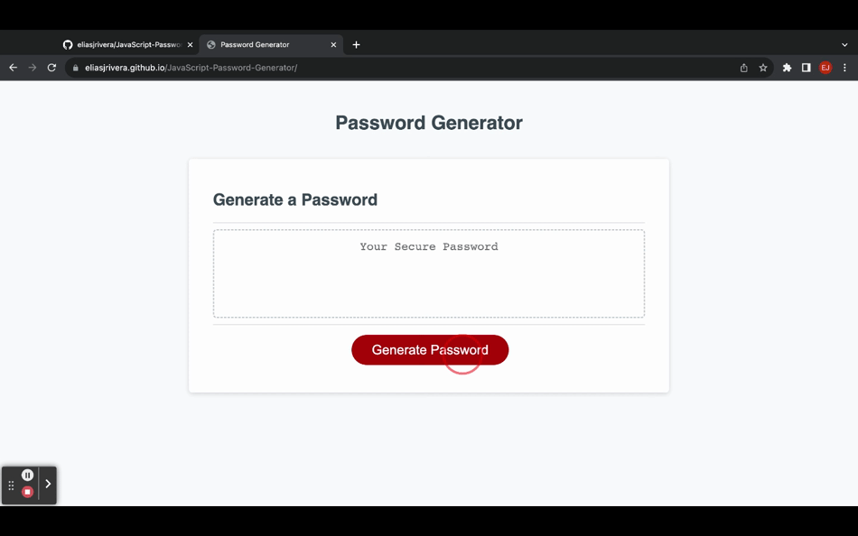

# Javascript Password Generator

## Table of Contents
- [Description](#description)
- [User Story](#user-story)
- [Acceptance Criteria](#acceptance-criteria)
- [Visuals](#visuals)
- [Project Repo](#project-repo)
- [Deployed Site](#deployed-site)
- [Visuals](#visuals)
- [Installation](#installation)
- [Usage](#usage)
- [Support](#support)
- [Contributing](#contributing)
- [Authors and Acknowledgement](#authors-and-acknowledgement)
- [Project Status](#project-status)

## Description
  
### User Story
  
```
AS AN employee with access to sensitive data
I WANT to randomly generate a password that meets certain criteria
SO THAT I can create a strong password that provides greater security
```

### Acceptance Criteria

```
GIVEN I need a new, secure password
WHEN I click the button to generate a password
THEN I am presented with a series of prompts for password criteria
WHEN prompted for password criteria
THEN I select which criteria to include in the password
WHEN prompted for the length of the password
THEN I choose a length of at least 8 characters and no more than 128 characters
WHEN asked for character types to include in the password
THEN I confirm whether or not to include lowercase, uppercase, numeric, and/or special characters
WHEN I answer each prompt
THEN my input should be validated and at least one character type should be selected
WHEN all prompts are answered
THEN a password is generated that matches the selected criteria
WHEN the password is generated
THEN the password is either displayed in an alert or written to the page
```

## Project Repo
[Elias Rivera GitHub Repo](https://github.com/eliasjrivera/JavaScript-Password-Generator)

## Deployed Site
[Javascript Password Generator Deployed Site](https://eliasjrivera.github.io/JavaScript-Password-Generator/)

## Visuals


## Installation
`git clone git@github.com:eliasjrivera/JavaScript-Password-Generator.git`

`Open in Google Chrome`

## Support
Elias Rivera

eliasjohnrivera@gmail.com

## Contributing
Contributors should read the installation section

## Authors and Acknowledgement
Elias Rivera

## Project Status
Project is finished
